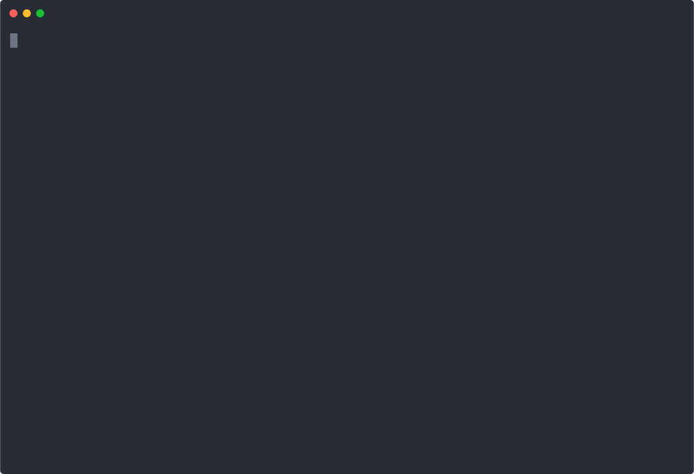

# Berth

Berth opens consistent project workspaces on local or remote hosts.

By default Berth auto-discovers local runtime support. If rootless Podman is available, local workspaces run in a Podman environment with the project mounted at `/workspace`, selected config files mounted into the container, and lifecycle state recorded for idle cleanup. If Podman is unavailable, Berth falls back to a bare shell in the project directory. Explicit config can opt out.



## Usage

```bash
berth new myproject ~/projects/myproject
berth enter myproject
berth run myproject cargo test --quiet
berth stop myproject
berth reap
berth daemon --interval-seconds 300
berth doctor
berth list
```

The implicit `berth NAME` shorthand is intentionally disabled. Install shell niceties instead:

```bash
eval "$(berth shell-init)"
eval "$(berth shell-completions)"
b myproject
```

The shell integration provides `b NAME`, a `berth enter` wrapper, completion, and an auto-entry hook for new terminal tabs. The hook reads a terminal user variable (WezTerm / iTerm2) or the explicit `BERTH_PROJECT_HINT` env var to know which workspace the new tab should join — it never hijacks `$PWD` or `$OSC 7` for signalling, so new tabs land in the parent shell's directory as usual.

## Configuration

Config file: `~/.config/berth/config.yaml`, or `BERTH_CONFIG_DIR/config.yaml` when `BERTH_CONFIG_DIR` is set.

```yaml
defaults:
  runtime:
    type: auto
  idle:
    shutdown_after_seconds: 3600

workspaces:
  myproject:
    path: ~/projects/myproject
    ports: [3000, 8080]

  containerproject:
    path: ~/projects/podproject
    runtime:
      type: podman
      image: docker.io/library/debian:stable-slim
      project_mount: /workspace
      userns: keep-id
    mounts:
      - source: ~/.gitconfig
        target: /home/dev/.gitconfig
        readonly: true

  bareproject:
    path: ~/projects/bareproject
    runtime:
      type: bare

  remoteproject:
    path: ~/projects/remoteproject
    remote: white-vm2

  kubeproject:
    path: ~/projects/kubeproject
    runtime:
      type: kubernetes-pod
      image: docker.io/library/debian:stable-slim
      namespace: dev
      pod_name: berth-kubeproject
```

## Runtime Behavior

Bare runtime starts the user's shell or command directly in the project directory.

`runtime.type: auto` is the built-in default for local workspaces. It selects Podman when `podman` is on `PATH`; otherwise it selects bare. Set `defaults.runtime.type: bare` or a workspace `runtime.type: bare` to opt out. `berth doctor` shows the current discovery result, including Podman health, minikube profile/config detection, and Kubernetes pod defaults.

Podman runtime builds a rootless `podman run` command, mounts the project directory read/write, mounts configured files/directories readonly by default, sets the container workdir, and runs the requested shell or command. Berth uses `--userns=keep-id` when the local runtime supports it; otherwise it omits the user namespace argument. Set `runtime.userns` in config to force a specific Podman user namespace mode.

Kubernetes pod runtime builds `kubectl run` for `enter` and `run`, and `kubectl delete pod` for `stop` and expired-state reaping. It only contacts a cluster when those explicit commands are invoked by the user.

`berth reap` scans lifecycle state and stops expired local container environments. Podman workspaces are stopped with `podman stop berth-NAME`; Kubernetes pod workspaces are deleted with `kubectl delete pod` using the configured namespace and pod name. Bare workspaces and remote entries are not reaped locally.

`berth daemon` runs in the foreground and periodically invokes the same idle reaper used by `berth reap`. It does not install services, create timers, read secret-bearing environment values, or modify remote hosts. Use `--interval-seconds N` to configure the cadence and `--once` for one deterministic iteration under an external supervisor.

Remote entry uses SSH and does not install packages on the host. If `tmux` is already available remotely, Berth attaches to a named session for resumable shell behavior. If `tmux` is unavailable but `screen` exists, Berth uses a named `screen` session. Otherwise it falls back to a direct SSH shell. Plain SSH cannot reattach to a lost interactive process unless that process was launched under a remote multiplexer or supervisor.

## Testing

```bash
cargo test --quiet --lib
cargo test --quiet --test e2e
BERTH_REAL_PODMAN_E2E=1 cargo test --quiet --test e2e test_real_podman_workspace_run_executes_in_container
BERTH_REAL_PODMAN_E2E=1 cargo test --quiet --test e2e test_real_podman_daemon_once_reaps_live_container
cargo test --quiet --test e2e daemon
cargo test --quiet --test e2e reap
```

The default e2e suite still includes fast fake-exec checks for command construction. The gated Podman e2e path requires `podman` on `PATH` and runs a real Alpine container to verify project and config bind mounts.
